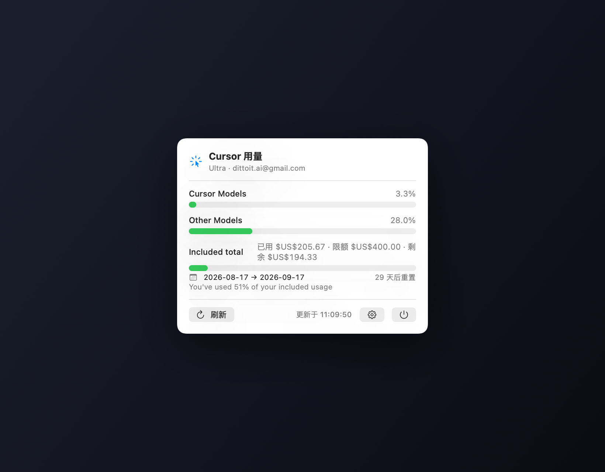
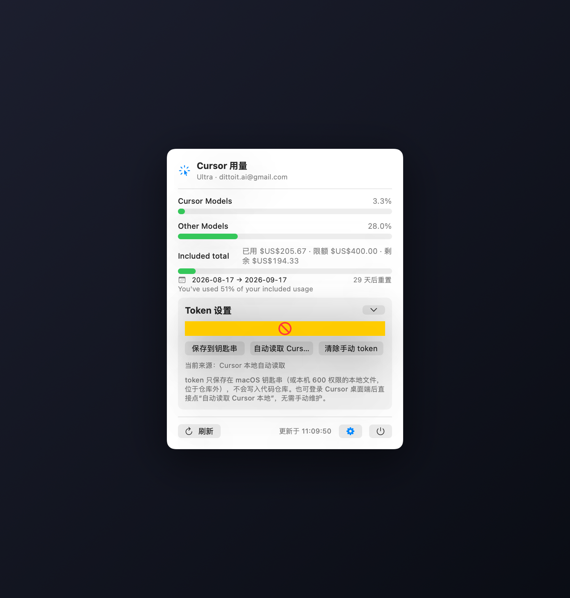
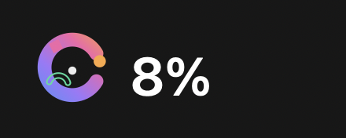

# CursorUsage 🖱️📊

**macOS 菜单栏 Cursor 用量实时查看器 · A macOS menu bar monitor for your Cursor usage**

Click the menu bar icon to see your current billing-cycle usage at a glance — **Cursor Models** and **Other Models** pools side by side, in dollars and percent.

点击菜单栏图标，一眼看清当前计费周期的用量：**Cursor Models** 与 **Other Models** 两个用量池的美元花费与百分比。

> ⚠️ **Unofficial tool** — not affiliated with Cursor. The API is reverse-engineered (see [RESEARCH.md](RESEARCH.md)) and may change without notice.
> **非官方工具**，不隶属于 Cursor。接口为逆向调研所得（见 [RESEARCH.md](RESEARCH.md)），可能随时变化。

---

## Screenshots · 截图

| Usage panel · 用量面板 | Token settings · Token 设置 | Menu bar · 菜单栏 |
|---|---|---|
|  |  |  |

*Screenshots rendered from real data on this machine (Ultra plan). · 截图为本机真实数据渲染（Ultra 套餐）。*

---

## Features · 功能

| English | 中文 |
|---|---|
| 🟦 **Menu bar resident** — abstract-art letter **C** icon + live total usage %, no Dock icon (`LSUIElement`) | 🟦 **菜单栏常驻**——抽象派字母 **C** 图标 + 实时合计用量百分比，无 Dock 图标 |
| ⚖️ **Two pools side by side**: Cursor Models (`autoPercentUsed`) and Other Models (`apiPercentUsed`), each with **exact dollar spend** derived from `GetAggregatedUsageEvents` (verified: sum == `planUsage.totalSpend`) | ⚖️ **双池并列展示**：Cursor Models（`autoPercentUsed`）与 Other Models（`apiPercentUsed`），各池**精确美元花费**由 `GetAggregatedUsageEvents` 按模型归属求和（实测合计 == `totalSpend`） |
| 💰 **Included total** — used / limit / remaining in USD (cents ÷ 100) + combined % | 💰 **合计用量**——已用 / 限额 / 剩余美元金额 + 综合百分比 |
| 🏆 **Top models by spend** (top 3) | 🏆 **Top 模型**（按花费前 3） |
| 📅 **Billing cycle** start → end, "resets in N days" | 📅 **计费周期**起止与“N 天后重置” |
| 🔄 **Auto refresh** — on open, every 60 s while open, every 5 min in background | 🔄 **自动刷新**——打开即拉取、打开期间每 60 s、后台每 5 min |
| 🔐 **Token settings** — save to **macOS Keychain**; ⚙️ toggles open/close (two collapse entries), or auto-read Cursor's local login (default), never stored in this repo | 🔐 **Token 设置**——保存到 **macOS 钥匙串**；⚙️ 可展开/收起（两处收起入口），或自动读取 Cursor 本地登录态（默认），绝不写入仓库 |
| 🛡️ **Zero dependencies** — pure Swift (AppKit + SwiftUI), no Electron, no runtime deps | 🛡️ **零依赖**——纯 Swift（AppKit + SwiftUI），无 Electron、无运行时依赖 |

---

## Quick Start · 快速开始

Requirements · 环境要求：macOS 12+, Xcode command line tools (`swiftc`), and Cursor signed in on this Mac (for auto token) or a manual token.

```bash
cd /Users/litianyi/Documents/Code/_ai-goods/cusor-usage

make selfcheck   # headless check: token + real API + keychain/file stores
                 # 无头自测：token 解析 + 真实 API + 钥匙串/文件存取
./run.sh         # build + package + launch the menu bar app
                 # 构建 + 打包 + 启动菜单栏应用
```

| Command · 命令 | What it does · 作用 |
|---|---|
| `make build` | Compile `build/CursorUsage` + generate `Info.plist` from `VERSION` |
| `make version` | Show current version / build number / tag |
| `make app` | Bundle `build/CursorUsage.app` (with generated icon) |
| `make package` | Build **zip + dmg** release artifacts (`build/CursorUsage-<ver>-macOS.*`) |
| `make selfcheck` | Headless verification with **real** API calls |
| `make screenshots` | Render product screenshots to `docs/screenshots/` |
| `make run` | Build & launch via `open` |
| `./run.sh` | One-shot: build + bundle + launch |

To quit: click the power button at the panel bottom, or `pkill CursorUsage`.
退出：点面板底部电源键，或 `pkill CursorUsage`。

### Releases · 版本与发布

- **Version source of truth · 版本单一来源**：`VERSION` file (SemVer) — bump it, CI builds with it.
- **CI** (`.github/workflows/ci.yml`): builds on every push/PR (macOS runner).
- **Release** (`.github/workflows/release.yml`): pushing a tag `v*` builds the app, packages **zip + dmg**, and creates a GitHub Release (e.g. `git tag v0.3.0 && git push origin v0.3.0`).
- Artifacts are **ad-hoc signed** (not notarized); first launch may need right-click → Open. 产物为 ad-hoc 签名，首次打开可能需要右键 → 打开。

---

## How It Works · 工作原理

Protocol: **Connect RPC v1 (JSON over HTTP)** — not gRPC-web.

```
POST https://api2.cursor.sh/aiserver.v1.DashboardService/GetCurrentPeriodUsage
Headers: Authorization: Bearer <token> · Content-Type: application/json
         Connect-Protocol-Version: 1
Body: {}
```

| Pool · 池 | Percent field · 百分比字段 | Dollar source · 美元来源 |
|---|---|---|
| Cursor Models | `planUsage.autoPercentUsed` | `GetAggregatedUsageEvents` sum of models in `autoBucketModels` |
| Other Models | `planUsage.apiPercentUsed` | …models not in `autoBucketModels` (claude-*/gpt-*) |
| Included total | `planUsage.totalPercentUsed` | `planUsage.totalSpend / limit / remaining` (cents) |

Full research (protocol, fields, token sources, uncertainties) → [RESEARCH.md](RESEARCH.md) · 完整调研见 [RESEARCH.md](RESEARCH.md)
Design & architecture → [DESIGN.md](DESIGN.md) · 实现方案见 [DESIGN.md](DESIGN.md)

---

## Token & Security · Token 与安全

| Source · 来源 | Notes · 说明 |
|---|---|
| Auto-read (default) · 自动读取（默认） | `~/Library/Application Support/Cursor/User/globalStorage/state.vscdb` → `cursorAuth/accessToken` (JWT, ~2 months validity), **read-only**, never written back |
| Manual · 手动 | Paste in ⚙️ settings → saved to **macOS Keychain** (`com.cursorusage.menubar`, `kSecAttrAccessibleAfterFirstUnlock`); fallback file `~/Library/Application Support/CursorUsage/config.json` (chmod 600, outside repo) |

- Token is **never committed** to the repo (`.gitignore` covers `build/`, `token.txt`, `*.token`; config lives outside the repo) · token 绝不入仓库
- The app never prints the token · 应用不打印 token
- HTTPS only · 仅走 HTTPS

---

## FAQ · 常见问题

- **“未找到 accessToken” / “No accessToken found”** — Cursor isn't signed in on this Mac, or `state.vscdb` is elsewhere; paste a token in ⚙️ settings. 本机未登录 Cursor 或状态库路径不同；在设置里手动粘贴。
- **HTTP 401** — token expired/invalid; click “自动读取 Cursor 本地” or paste a new one. token 失效；重新自动读取或粘贴新 token。
- **“响应中没有 planUsage”** — account shape differs (e.g. legacy request-based plan); the panel degrades gracefully. 账户形态不同（如旧版按请求计费），面板按缺失字段降级展示。
- **Keychain save fails** — rare restricted environment; automatically falls back to the 600-perm local file. 极少数受限环境；自动回退到 600 权限本地文件。
- **Troubleshooting / 排障** — runtime logs are written to `~/Library/Application Support/CursorUsage/app.log` (also NSLog); check them if the panel misbehaves. 运行日志在 `~/Library/Application Support/CursorUsage/app.log`（同时走 NSLog），面板异常时可查看。

---

## Project Structure · 项目结构

```
Sources/main.swift          entry: --selfcheck / --screenshot / --icon / --icns / GUI
Sources/AppDelegate.swift   status bar icon + self-positioned panel + timers
Sources/CursorIcon.swift    abstract-art letter-C status icon renderer
Sources/CursorAPI.swift     Connect JSON client + Codable models
Sources/TokenStore.swift    Keychain / 600-perm file / Cursor local (read-only)
Sources/PanelModel.swift    panel state machine (@MainActor) + pool dollar split
Sources/UsagePanel.swift    SwiftUI panel (two-pool meters + toggleable settings)
Sources/Screenshot.swift    product screenshots + app icon generator
Sources/SelfCheck.swift     headless verification
Sources/Info.plist.template .app bundle config (version injected from VERSION)
VERSION                     version source of truth (SemVer)
.github/workflows/          CI + Release (zip/dmg) workflows
Makefile / run.sh           build · test · package · launch
docs/screenshots/           product screenshots
```

## License · 许可

MIT — see [LICENSE](LICENSE).
